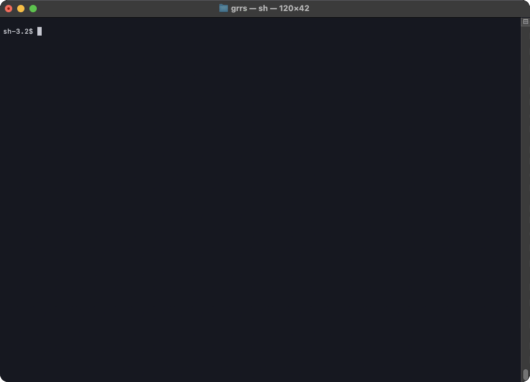

# grrs

based on
https://rust-cli.github.io/book/index.html

## Requirement

Rust 1.31.0 (or later)

# Additional Features

- accept multiple file paths, like original grep
- highlight matching pattern, like original grep


# Usage



```bash
# run
$ cargo run -- <PATTERN> <PATH>
# or build
$ cargo build
# then, run
$ target/debug/grrs <PATTERN> <PATH>
```
